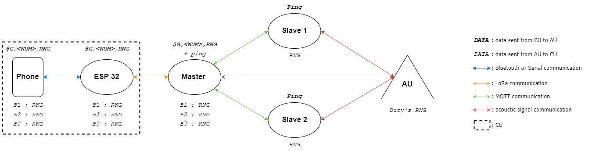

# buoys-ping

#Project overview

The objective of this project is the development of an underwater localization and communication system. This system is composed of one
group of three buoys (GoB), placed on the surface of the water, and one or more acoustic units (AU), immersed under the water. A central unit (CU), 
located on the shore or onboard a boat controls it.

Each of the 4 codes provided corresponds to one of the hardware listed above :

    • CU : ___Coast_board.ino___
    • Master buoy : ___Master_buoy.ino___
    • Slave buoys 1 & 2 : ___Slave_buoy_1.ino___ & ___Slave_buoy_2.ino___
    
The architecture of the system is as follows: 

# Software requirements

This project has been entirely coded in C++ on the Arduino IDE. On the IDE, you will need to install the ESP32 board in order to work on it. To do this, follow the tutorial at the following link: https://randomnerdtutorials.com/installing-the-esp32-board-in-arduino-ide-windows-instructions. Once done, select the ESP32-WROOM-DA Module board in Tools > Board > ESP32 Arduino.

To compile it, you will also need to download the following libraries:

    • LoRa by Sandeep Mistry - from the IDE library manager
    • ThingsBoard by ThingsBoard Team - from the IDE library manager
    • SafeString by PowerBroker2 - from GitHub : https://github.com/PowerBroker2/SafeString.git
    • PubSubClient by Nick O'Leary - from the IDE library manager
    • sMQTTBroker by Vyacheslav Shiryaev - from the IDE library manager
    • ArduinoHttpClient by Arduino - from the IDE library manager
    • ArduinoJson by Benoît Blanchon - from the IDE library manager

The SPI and WiFi libraries are also required but are normally installed automatically with the installation of the ESP32 board on the IDE.

# How to use the system ?

## Procedure

This section explain the different steps to respect to use the device properly. 

    • Step 1 : Download each of the 4 codes on 4 different boards.
    • Step 2 : Turn on the CU's and the three buoys' ESP32 boards. Please note that the buoys boards must be switched on in a specific order to 
    allow them to be connected to the WiFi AP and to the broker, for MQTT communication : first the master buoy, then the slave buoy (number 1) with the WiFi AP and finally the other slave buoy (number 2). 
    • Step 3 : On a phone, download an mobile application providing a serial USB terminal (Serial USB Terminal or Bluetooth for Arduino for example). From this terminal, send the address(es) of the AU( s) to be pinged. If only one AU is to be pinged, the message to be sent should be of the form "$G,<NUM>,RNG", where NUM corresponds to the three digits identifier of the unit. If several AUs are to be pinged, then the message to be sent should be of the form "$G,<NUM1>,RNG;$G,<NUM2>,RNG". Be careful! Do not add a space before or after the semicolon,  at the end of the message or between words, otherwise the ping of some AUs will not be taken into account.

## Data back-up

The data retrieved by the CU are saved on a web server. To access it, a ThingsBoard dashboard has
been created, which makes it easier to visualise.To access the dashboard, from a computer, simply go to the following address : https://demo.thingsboard.io/dashboard/5bd46900-069e-11ed-8857-89a1708eda91?publicId=e95a4020-0e72-11ed-9c79-ad222c995ab7. Be careful ! The board has to be connected to the same network than the computer for the connection to the server to be established.

The dashboard is very basic : it only contains a time-series table, displaying the data received by the CU in the last 24 hours.

